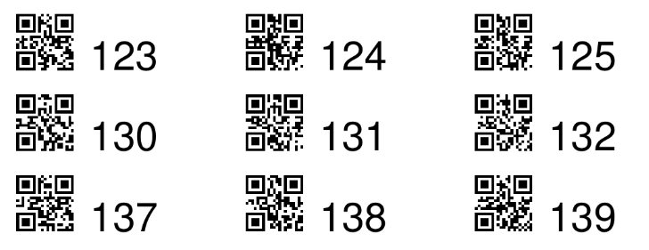

# paperless-asn-labels

`paperless-asn-labels` generates PDF documents with archive serial numbers (ASN), both as a machine-readable QR code
and a human-readable number.

Loosely inspired by https://github.com/entropia/paperless-asn-qr-codes.

## Installation

```console
pipx install paperless-asn-labels
```

## Usage

Run `paperless-asn-labels --help` for supported commands and options.

The output will contain pairs of QR codes and numbers as seen below.

